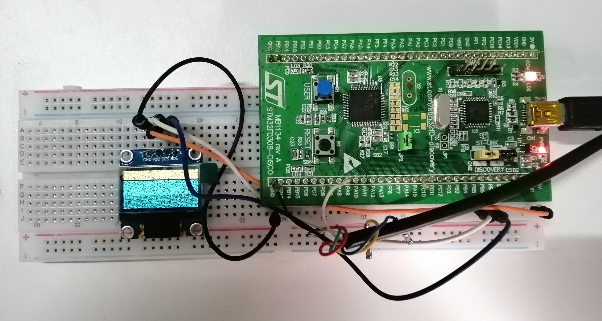

# rtos_u8g2

#### **Overview**

Integration of the u8g2 display library into FreeRTOS project.

#### Board Setup:


#### Compile and build:
  1. From the ```Project``` directory execute: ```$ make``` to build the project;
  2. Execute: ```$ make clean``` to remove the ```/build``` folder with its output files;

#### Compiler setup:

#### Flashing and on target debugging:
  1. Start OpenOCD server by: ```$ openocd -f "board/stm32f0discovery.cfg"```;
  2. Execute: ```$ ./flash``` for flashing or: ```$ ./dbg``` to debug the project;
  3. Serial interface (UART) debugging: ```cu -l /dev/ttyUSB0 -s 9600```
